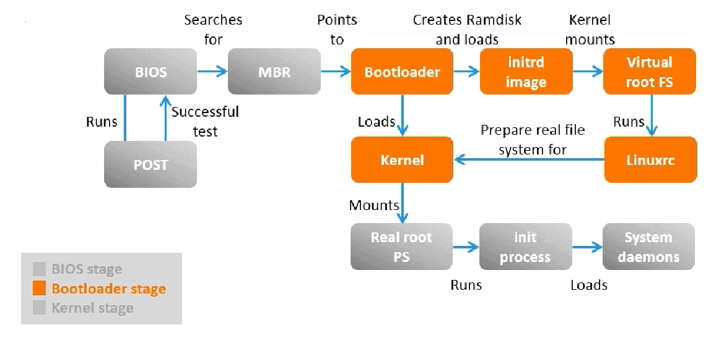

# How OS boot works
Have you ever wondered why the OS (Operating System) which may be several GBs fit into smaller RAM size?
When I was a kid, I had this question the Windows XP OS itself is 1.5 GB but my RAM capacity was just 1 GB.
Understanding how OS boot works will answer this question and also helps in understanding how Dual Boot and Virtual Machines OS works.

# Vocabulary
* BootStrap - bootstrap is actually means a loop attached to the top or side of a boot/shoe to help with pulling it on. Similarly bootstrap in CPU helps in pulling the OS kernel on.
* Kernel - means **Core** where root and shoot grows(Biology). So this grows between computer's CPU(root) and Shell/Software (shoot).Process Management, Context Switching, Resource Manage, Inter Process Communication, Protected Memory Space. Kerenl does all this(Hats off)
* **Firmware** 
	- a piece of code stored in the hardware (like between hardware and software).
	- will start executing this immediately when powered.
    - more like code stored in microcontroller boards like Arduino
* BIOS- Basic Input Output system (**Firmware**)
* MBR- Master Boot Record
* POST - Power-On Self-Test
* BootLoader - loads OS kernels
* OS Image - Whole OS object which contains kernel, System utils and components. This is what you download.

# Architecture

* The BIOS is a firmware, so it will be executed first. The BIOS run health checks and loads MRB and BootLoader
* **BootLoaders** are package like GRUB (GRand Unified Bootloader) used to load the OS kernel in RAM.
	* This is where you can choose OS if you have more than one OS (Dual booted).
	* The Bootloader keeps OS --> Kernel Config mapped table.
	* On selection or automatically selected Kernel Config will be appended.
	* The config will have location of the OS image. The OS images will be stored in Storage spaces like HDD or SSD ( Don't use ROM it was an millennial term; use non-volatile storage space). This will contain kernel.
	* Bootloader loads the kernel in the RAM and passes control to it.
* The **kernel** will stay in the RAM throughout the system's lifetime.
	* This is why even when you clear everything, you can still see some RAM space not getting cleared.
	* He is the MC in this computer world.
	* The kernel size is usually less and this is the reason the RAM is not fully occupied by the OS image size.
	* The OS image usually contains less used components,libraries and utils that can be mounted on demand.
* In VM (Virtual Machine) this will actually done in a virtualized environment. That's right the VM will have its own bootloader, stores kernel image in Storage space and the kernel will be in RAM(yes shares same physical RAM but sandboxed or quarantined 👀), as long as the VM instance is alive.

# See You!
That’s the high-level journey from powering on your computer to seeing your desktop. Next time you dual-boot or spin up a VM, you’ll know exactly what’s happening behind the scenes! 🚀