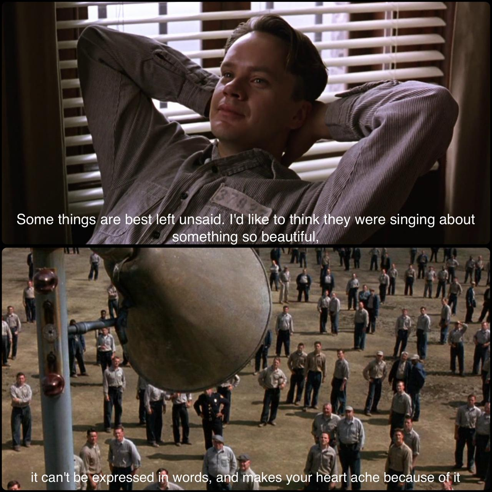

# Best Poems in my Childhood
In my childhood, many poems fascinated me.
**Poems are strange things — their words sometimes sharp as spears, other times soft as marshmallows; at once moral armor, then a meticulously aimed arrow.**
 
Even though my school wanted me to memorise many poems most of them were washed away in the river of time.

# Motive
## Begin at the Dusk 🌇
I still remember it like yesterday when I was in my Third year of my under graduation, a classmate and I went for a hike. The day was filled with pleasant weather, the dusk was set for weary souls to find their way home. We knew each other only as classmates. We had some weird questions and shared a weird silence definitely not an akward one. Rather than filling the silence with comforting words under the pretense of  cheer, we let the silence gently pass. Our conversation became either about art and wisdom or none. Then I found out that he was also strangely into poetry, then we started speaking about the poems from our childhood days and wow! I never thought I could remember the gist, meanings and some exact lines of those poems and this guy he was far greater than me when it comes to poetry. 
## For a friend🍷
I earned a friend that day! In the hope and in the memory of the day, I am writing this blog. First, I thought about writing only the part I love from this poem, but I think I got more space, so the full poem will be there and the post is going to be long like art referring to 'art is long life is short' proverb, not a narcissistic way of claiming this as an art

# Poems
I don't believe in life changing words that will change your life entirely, but many lines in these poems resonate in many walks of my life and shaped me and help me to know my natural frequency. Yes, there is a possibility that it can shatter you from inside.
 

    <h3 style="margin-left:155px">THE MAN HE KILLED</h3>
    Had he and I but met 
    By some old ancient inn,
    We should have sat us down to wet 
    Right many a nipperkin!
    
    But ranged as infantry, 
    And staring face to face,
    I shot at him as he at me, 
    And killed him in his place.
    
    <strong>I shot him dead because ---
    Because he was my foe,
    Just so: my foe of course he was; 
    That's clear enough; although.</strong>
    
    He thought he'd 'list, perhaps, 
    Off-hand like- just as I -
    Was out of work - had sold his traps 
    No other reason why.
    
    Yes; quaint and curious war is! 
    <strong>You shoot a fellow down 
    You'd treat if met where any bar is 
    Or help to half-a-crown.</strong>
    
<i>-Thomas Hardy</i>

Whenever I hear a news about war, just because two insane leaders did something, I remember this poem. This is how most of the soldiers would have thought.

    <h3 style="margin-left:155px">MANLINESS</h3>If you can dream and not make dreams your master;
    If you can think and not make thoughts your aim; 
    <strong>If you can meet with triumph and disaster; 
    And treat those two impostors just the same;</strong>
    
    If you can force your heart, and nerve, and sinew 
    To serve your turn long after they are gone; 
    And so hold on when there is nothing in you 
    Except the will which says to them, "Hold on".
    
    <strong>If you can fill the unforgiving minute 
    With sixty seconds' worth of distance run, 
    Yours is the earth and everything that's in it, 
    And, what is more, you'll be a man, my son.</strong>
    
<i>-Rudyard kipling</i>

Calling triumph and disaster as impostors was actually lovable. And what's more you will be man, my son! (woman and daughter won't rhyme well 🙃)

    <h3 style="margin-left:155px"> MIGRANT BIRD</h3>The globe's my world. The cloud's my kin 
    I care not where the skies begin;
    <strong>I spread my wings through all the din; </strong>
    Through fears and fright I fly my flight.
    <strong>No walls for me, no vigil gates, 
    No flags, no machine guns that blast 
    Citizens of those border states-
    Brothers of her brother's sons.</strong>
    No maps, no boundaries to block 
    My sojourn into unknown lands.
    I spawn and splash in distant spills, 
    I breed my brood where'r I will.
    I won't look down. No I will not.
    With speed of wings I hasten past 
    And close my eyes against the sun 
    To dream my dreams and make them last.
    
<i>-Famida Y. Basheer</i>

As you can see this poem is not exactly about birds. This poem shows how narrow and self-centred our lives and thoughts are.

    <h3 style="margin-left:155px">THE SOLITARY REAPER</h3>Behold her, single in the field, 
    Yon solitary Highland Lass! 
    Reaping and singing by herself; 
    <strong>Stop here, or gently pass!</strong>
    Alone she cuts and binds the grain, 
    And sings a melancholy strain; 
    O listen! for the vale profound 
    Is overflowing with the sound.
    
    No nightingale did ever chaunt 
    More welcome notes to weary bands 
    Of travellers in some shady haunt, 
    Among Arabian sands:
    A voice so thrilling ne'er was heard 
    In spring-time from the cuco-bird, 
    Breaking the silence of the seas 
    Among the farthest Hebrides.
    
    Will no one tell me what she sings? 
    Perhaps the plaintive numbers flow 
    For old, unhappy, far-off things, 
    And battles long ago: 
    Or is it some more humble lay, 
    Familiar matter of to-day?
    Some natural sorrow, loss, or pain, 
    That has been, and may be again!
    
    What'er the theme, the maiden sang 
    As if her song could have no ending: 
    I saw her singing at her work, 
    And o'er the sickle bending 
    <strong>I listen'd motionless and still;
    And, as I mounted up the hill,
    The music in my heart I bore
    Long after it was heard no more.</strong>
    
<i>-William Wordsworth</i>

The author doesn't understand the song of the reaper but still listened motionless. You remember this scene in ***The Shawshank Redemption*** ? this is exactly that 🎶.

>Red: I have no idea to this day what those two Italian ladies were singing about. Truth is, I don't want to know. Some things are best left unsaid. I'd like to think they were singing about something so beautiful, it can't be expressed in words, and makes your heart ache because of it.

    <h3 style="margin-left:155px">Gitanjali</h3>Where the mind is without fear and the head is held high
    <strong>Where knowledge is free
    Where the world has not been broken up into fragments
    By narrow domestic walls</strong>
    Where words come out from the depth of truth
    Where tireless striving stretches its arms towards perfection
    Where the clear stream of reason has not lost its way
    Into the dreary desert sand of dead habit
    Where the mind is led forward by thee
    Into ever-widening thought and action
    <strong>Into that heaven of freedom, my Father, let my country awake.</strong>
    
<i>- Rabindranath Tagore</i>

Remember migratory bird poem 'no walls for me'. Both poem support the concept of being boundless

    <h3 style="margin-left:155px">Discovery</h3>
    I want to climb the highest tree  
    Study stars and their mystery  
    I want to touch the clouds above  
    Find someone I can talk to, now!
    I want to be a designer  
    Make dreams that just don't disappear  
    <strong>I want to be an artist too  
    Paint pictures of me and you.</strong>
    There are lots of things on this earth  
    New ideas that are taking birth  
    <strong>But before I discover what I want to be  
    I must learn to discover me</strong>

<i>-Gayatri Pahlajani</i>

This may sound more like rhymes. But I actually loved this, since it fit my ADHD energy 😉.

# Bye
These poems didn’t just fill my childhood—they shaped the way I see courage, kindness, and freedom. Revisiting them now, I realize they’re still whispering to me. Maybe some of them will whisper to you too...