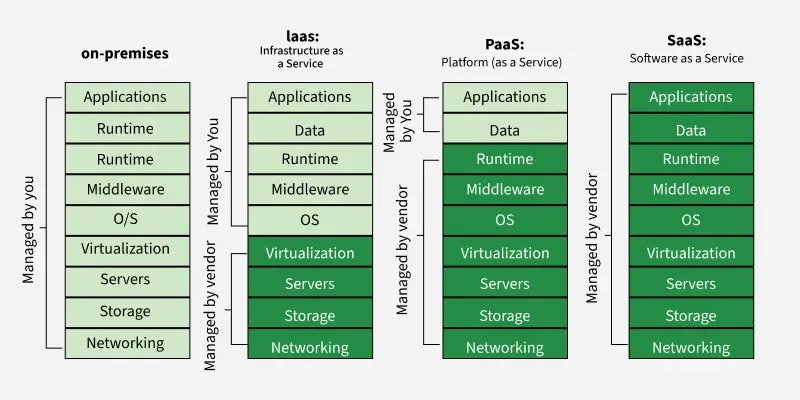

# Computing
The word Computing means using just using computers. computer - ***com (together)*** + puter(settle) since computers were first invented for mathematical calculations; more like com- promise (together + consent), com-press, com-pound (combined together).

# Cloud Computing
Cloud Computing refers to using remote computers with the help of internet. Cloud Computing is the on-demand delivery of compute power, database storage, application (A computer need all this to act as a server). Cloud computing services include computer resources, data storage, apps, servers, development tools, and networking protocols. 

# Advantages of Cloud Computing
Consider we bought a gaming laptop for a price. We paid a standard price even when we use less CPUs, less time or used less storage and need to stick with same CPU, OS and storage upper limit. Cloud computing solves all this disadvantages
* **pay-as-you-go** pay only for used computing
    *  It's more like renting a bike. you pay for fuel / operational cost mostly.
* **Rapid elasticity and scalability** provision exactly the right type and size of computing; can grow or shrink when needed.
* Cloud advantage -> access anytime we need almost instantly **Broad network access**.
* Multi-tenancy and resource pooling -> multiple customer can access securely(server attribute).
The Cloud Computing service provider deals maintaining the hardware like cooling CPUs, disaster recovery, storage management etc.

# Vocabulary
* Throughput
* Hot swapping
* OG
    * punched cards -> paper-based medium used to store digital information through the presence or absence of holes in predefined positions
    * tape drives -> more like punched cards but tape version
    * Magnetic tape -> magnetic field at one direction 0 another 1, can last for 30 years max

# Evolution
Even though this may seems useless, the info is really useful for understanding the fundamentals.
## Mainframe computers
* large cabinet or “frame” -> The CPU is housed inside large cabinets, peripheral devices like punched card readers, tape drives, and printers were connected externally.
* bulk data processing
* characterized less by raw computational speed and massive throughput
* **Hot swapping** hardware like processors and memory
* high availability -> since server needs almost zero downtime
* attached with terminal display and keyboard (hacker movies)

## Distributed System or Decentralized Computing
* The components of a distributed system communicate and coordinate their actions by passing messages to one another in order to achieve a common goal.
* [GFG](https://www.geeksforgeeks.org/computer-networks/what-is-a-distributed-system/)

## Cluster 

## Grid Computing
* different systems were placed at entirely different geographical locations and these all were connected via the internet

## Virtualization
* creating a virtual layer over the hardware which allows the user to run multiple instances simultaneously on the hardware.
* Traditional virtualization uses hypervision between hardware and guest OS. VMware, Virtual Box.
* AWS uses Nitro cards for offloading network, storage and security

## Service Orientation
* Software as a Service

# Cloud Services

* Infrastructure as service -> AWS services
* Platform as Service
    * more like railway platform. train will come and go only ticket booking APP and passengers details DATA need to be maintained by us.
* Software as service -> full app and data too managed by the service

# Ref
* [Distributed Computing](https://en.wikipedia.org/wiki/Distributed_computing)
* [Evolution of Cloud Computing GFG](https://www.geeksforgeeks.org/cloud-computing/evolution-of-cloud-computing/)