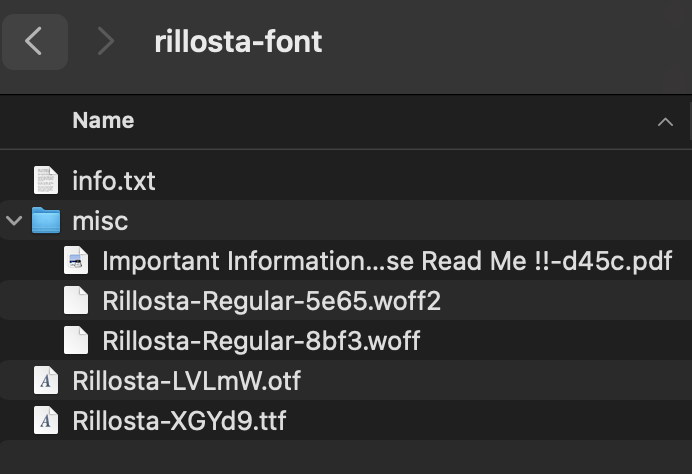

# Font
Have you ever wanted to add new icons to your website because you hired someone for UI design? If you want to use your own or open source icons and fonts, you can use some css special instructions to attain this.
`@font-face` makes it possible to design content without being limited to the so-called "web-safe" fonts (that is, the fonts that are so common that they're considered to be universally available).

# Syntax
```css
@font-face {
  font-family: "Trickster";
  src:
    local("Trickster"),
    url("trickster-COLRv1.otf") format("opentype"),
    url("trickster-outline.woff") format("woff");
}
```

# Font MIME Types
Not all browser supports same font format. So we will have 3-4 urls and files
| Font Format | MIME Type                       | Purpose / History                                  | Format |
| ----------- | ------------------------------- | -------------------------------------------------- | --|
| `.woff2`    | `font/woff2`                    | Modern, compressed, small (most used today).       | "woff2" |
| `.woff`     | `font/woff`                     | Older WOFF format, fallback for older browsers.    | "woff" |
| `.ttf`      | `font/ttf`                      | TrueType font, widely supported but bigger.        | "truetype" |
| `.otf`      | `font/otf`                      | OpenType font, similar to TTF with extra features. | "opentype" |
| `.eot`      | `application/vnd.ms-fontobject` | Required by Internet Explorer (legacy).            | "embedded-opentype"|
| `.svg`      | `image/svg+xml`                 | Used for very old iOS Safari (pre-iOS 5).          | "svg" |


# Usage
* Web fonts are subject to the same domain restriction (font files must be on the same domain as the page using them).
* Using a declaration. We can directly declare the font family inside the class
```css
.tricky{
    font-family: "Movie";
}
```
* Using selectors to easily select classes -> We can select the font family when a class starts with a prefix (here: Movie-)
``` css
    [class^="Movie-"],
    [class*="Movie-"] {
        font-family: "Movie";
    }
    /* For icons use before or after*/
    [class^="Movie-"]:before,
    [class*="Movie-"]:before {
        font-family: "Movie";
    }
```
and can have elements like
```html
<div class="eleclass Movie-F1"></div>
```
to use the font family for the element and before and after pseudo-selectors while appending icons.
* The font family will only load the file when it encounters   `font-family: "Movie"` declaration or any class starts with `Movie-` prefix (case 2).

# Font
The font file looks like this; copy the folder or just file you need and paste it into your repo


```css
@font-face {
    font-family: "rillosta";
    src: 
        url(../font/rillosta-font/Rillosta-LVLmW.otf) format("opentype"),
        url(../font/rillosta-font/Rillosta-XGYd9.ttf) format("truetype");
    ;
}

.rillo{
    font-family: "rillosta";
}
/* Including this class name makes the content in that font */
```

# Icons
* You can either download already available on the web as svg format and use icomoon (mentioned below) or create your own icons using apps like figma and export them as svg format to use them.
* Previewing and downloading it in desired format can be done by icomoon.
## [Icomoon](https://icomoon.io/app/#/select)
* It is a web app where you can upload an svg or other icon format and preview the icons.
* We can also hand pick icons and create font file from it. It will generate a font zip file that have fonts in svg, eot, ttf and woff formats.
* Using preview, we can know the code for the icon(hex code) and use that inside css declaration
    * Note: As of now, Icomoon has some bug like the codes may be incorrect when you delete something are modify the icons in preview mode. 
```css
.star:before{
    content:"\e9a5";
    /* Using `\` is mandatory to represent CSS Unicode points */
}
```

# Output

* The output will look like this

html code use:
```html
    <style>
        @font-face {
            font-family: "rillosta";
            src: 
                url(../font/rillosta-font/Rillosta-LVLmW.otf) format("opentype"),
                url(../font/rillosta-font/Rillosta-XGYd9.ttf) format("truetype");
            ;
        }
        .rillo{
            font-family: "rillosta";
        }
        @font-face {
            font-family: "star";
            src: url(../font/icons/icomoon.woff) format("opentype");
        }
        .star:before {
            font-family: "star";
            content: "\e901";
        }
    </style>
    <div style="font-size: x-large;">Normal text</div>
    <br>
    <div class="rillo" style="font-size: x-large;">Font Changed text</div>
    <br>
    <div class="star" style="font-size: x-large;"> Icon before this</div>
```


